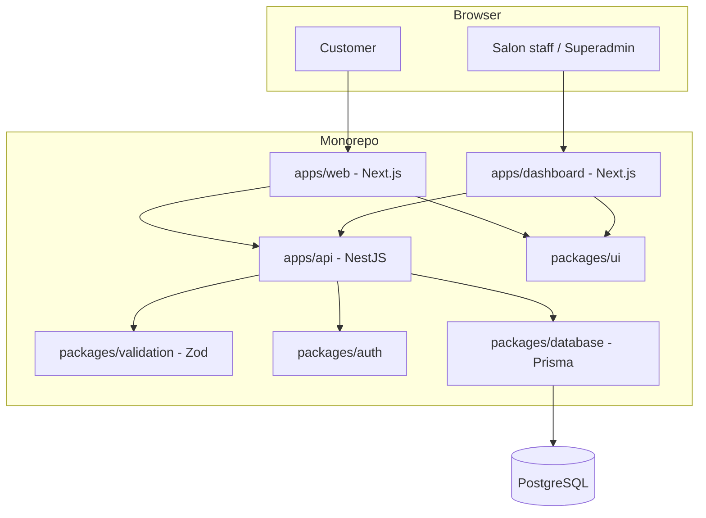

# Container Diagram

Both frontend apps import `packages/ui` and `packages/validation` (shared Zod schemas with the API, so
client-side validation and server-side validation never drift). Only `apps/api` (via `packages/database`)
holds a Postgres connection.
