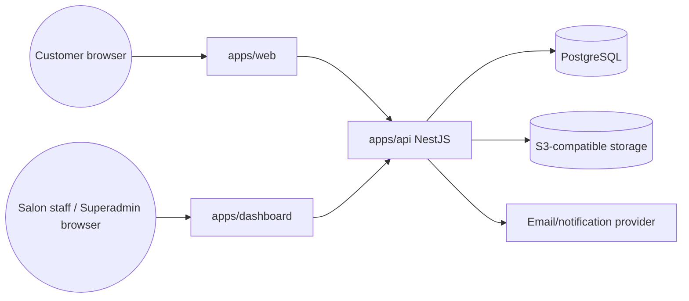

# Context Diagram

Public internet reaches only `apps/web`, `apps/dashboard`, and `apps/api`. Postgres and storage are never
directly reachable from the browser; uploads use signed URLs issued by the API.
