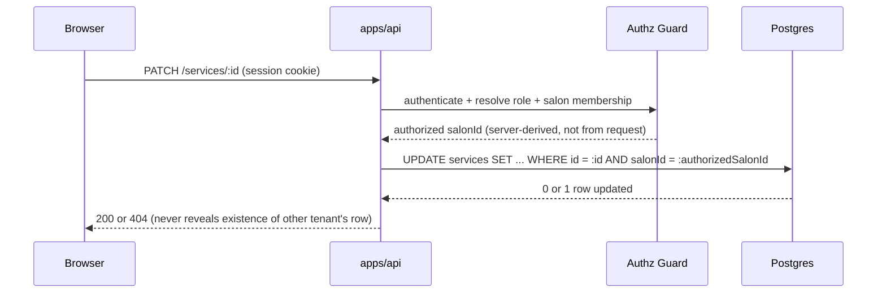

# Request Flows

## Tenant-scoped write (e.g. SALON_ADMIN edits a service)

Key rule: the `WHERE salonId = :authorizedSalonId` clause is part of the query itself, never a
check performed after an unscoped `findById`.

## Reservation creation

See [reservation-concurrency ADR](../adr/0005-reservation-concurrency.md) and the authoritative
`docs/Salonomia_Optimal_Customer_Reservation_Flow.md` §9 for the full server-side sequence.
