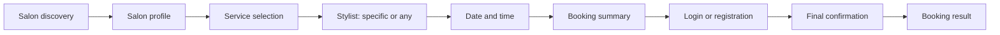
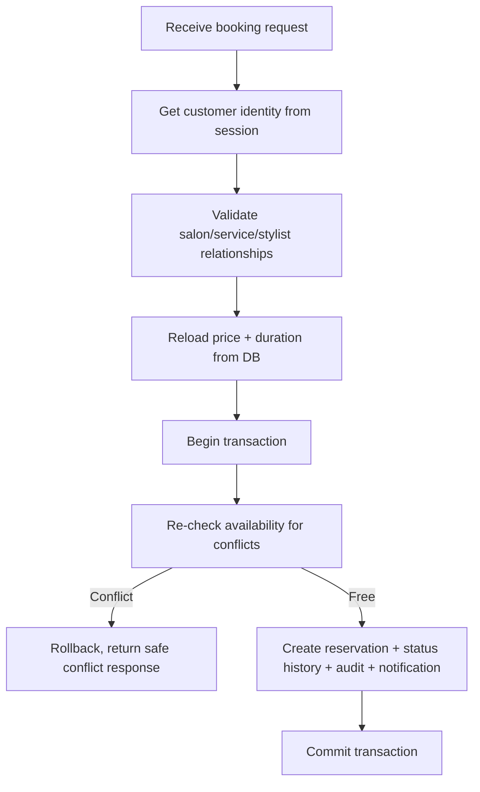
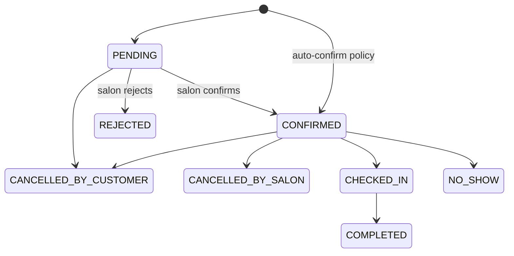
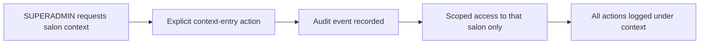

# Key User Flows

Full step-by-step UX/validation/security detail lives in
`docs/Salonomia_Optimal_Customer_Reservation_Flow.md` (authoritative for the customer booking journey).
This document gives only the four most important flows as diagrams.

## 1. Customer booking flow

## 2. Server-side reservation creation (concurrency-safe)

## 3. Reservation status lifecycle

## 4. SUPERADMIN audited salon-context entry

